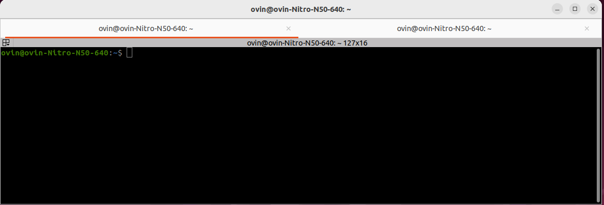
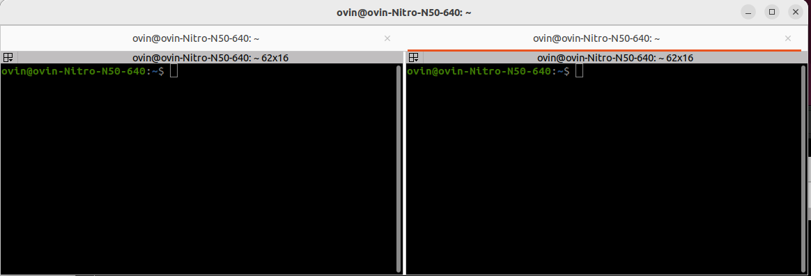
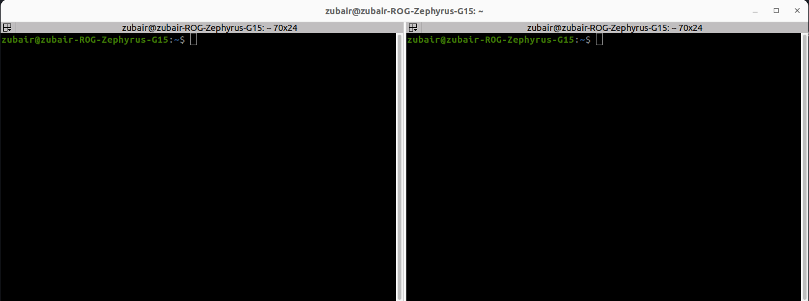
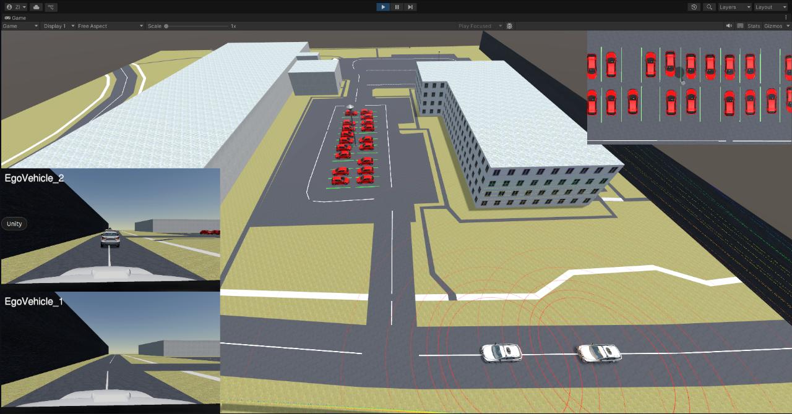
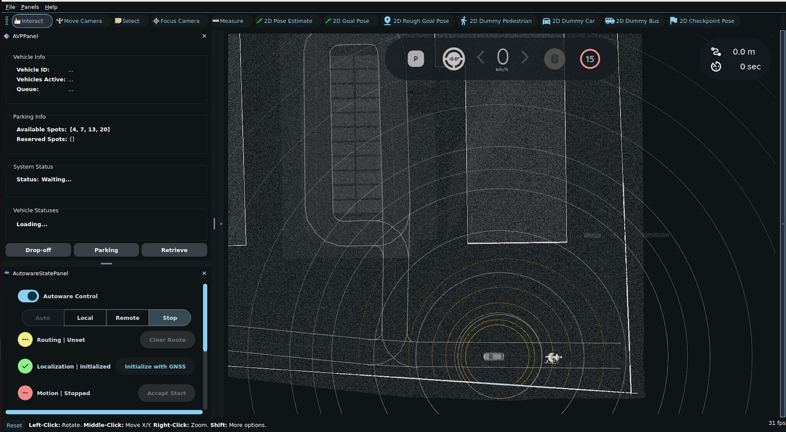
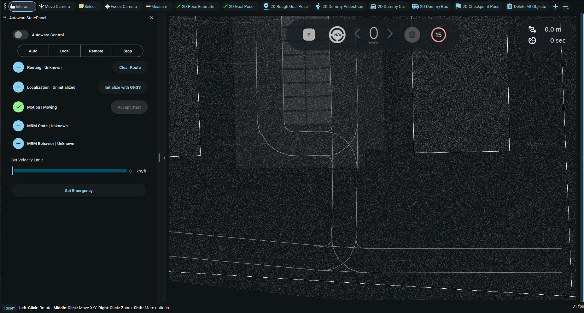
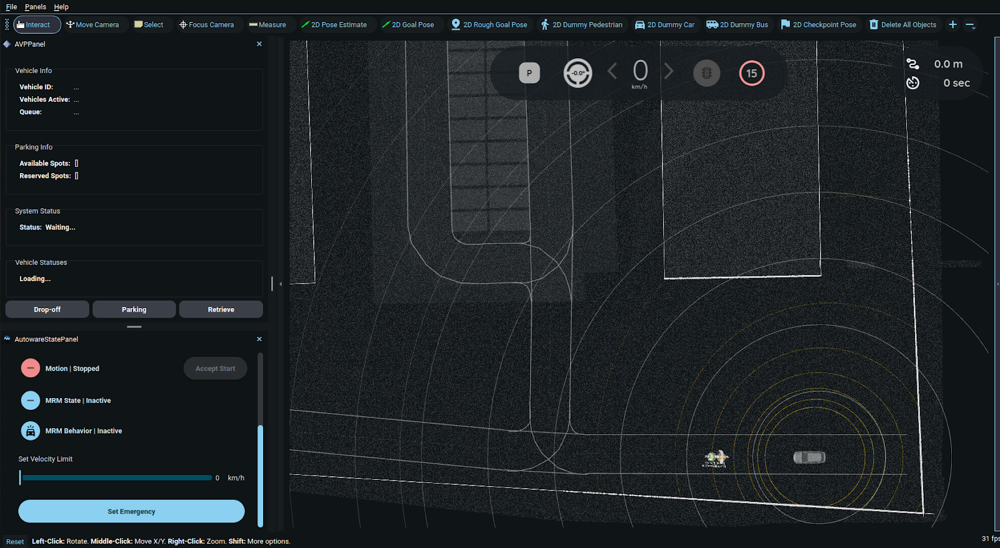

# Multi-Vehicle Simulation

## Prerequisites
Ensure the following components are set up on each host:

- **Host 1:** AWSIM Labs, Autoware, and Zenoh
- **Host 2:** Autoware and Zenoh

---

## Terminal Setup with Terminator

For better visibility and parallel execution, it is recommended to use Terminator instead of the default terminal.  

### Host 1
Open Terminator and create **two tabs**.  

- **Tab 1:** leave as a single terminal.  

      

- **Tab 2:** split into two vertical panes (side by side).  

      

### Host 2
Open Terminator with a **single tab**, then split it into two vertical panes.  




This layout provides a clean and organized workspace for operating the framework.  

---

## Launch Sequence
1. **Launch AWSIM Labs** (Host 1)

      In **Tab 1**, run the following command to open Unity Hub:  
      
      ```bash
      ~/Unity/UnityHub.AppImage
      ```
      > ROS 2 should **not** be sourced in the terminal.  

      From Unity Hub, open the project and start the scene.

      


2. **Launch Autoware**

    **Host 1**
      
      In the left pane of Tab 2, run:

      ```bash
      source /opt/ros/humble/setup.bash
      source ~/autoware/install/setup.bash
      ros2 launch autoware_launch e2e_simulator.launch.xml vehicle_model:=awsim_labs_vehicle sensor_model:=awsim_labs_sensor_kit map_path:=$HOME/autoware_map/sirc/ launch_vehicle_interface:=true
      ```
    
      On Host 1, Autoware automatically connects to AWSIM Labs because both components are running on the same machine.

      

      **Host 2**

      In the left pane, run:

      ```bash
      source /opt/ros/humble/setup.bash
      source ~/autoware/install/setup.bash
      ros2 launch autoware_launch e2e_simulator.launch.xml vehicle_model:=awsim_labs_vehicle sensor_model:=awsim_labs_sensor_kit map_path:=$HOME/autoware_map/sirc/ launch_vehicle_interface:=true
      ```
      On Host 2, Autoware will remain in a waiting state until it receives an initial pose via Zenoh.

      


3. **Run the Zenoh Bridges**

      **Host 1**

      In the right pane of Tab 2, run:

      ```bash
      source ~/zenoh-plugin-ros2dds/install/setup.bash
      zenoh_bridge_ros2dds -c ~/multi-vehicle-framework/zenoh_configs/zenoh-bridge-awsim.json5
      ```

      **Host 2**

      In the right pane, run:

      ```bash
      source ~/zenoh-plugin-ros2dds/install/setup.bash
      zenoh_bridge_ros2dds -c ~/multi-vehicle-framework/zenoh_configs/zenoh-bridge-vehicle2.json5 -e tcp/<IP-address>:7447
      ```
      > Replace `<IP-address>` with the Host 1 IP address found in Step 3 of the [Zenoh Installation Steps](software-installation.md/#installation-steps_1).

      Once both Zenoh Bridges are connected, Autoware on Host 2 immediately receives the initial pose and localizes successfully.

      


## Multi-Vehicle Demonstration

<iframe width="560" height="315" src="https://www.youtube.com/embed/47XUYeN61CI?list=PL4MADLjXmDi1Q5XXCuFTEntWz1c_T50jd" title="YouTube video" frameborder="0" allowfullscreen></iframe>

---

**Next Steps:** To scale this setup beyond two vehicles, see [Scaling to More Vehicles](../../Scalability/ScalingToMoreVehicles/index.md).  


