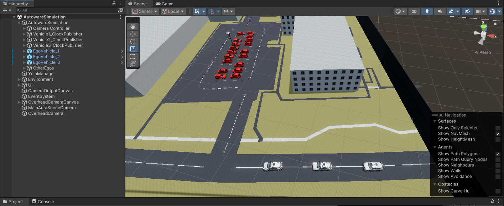
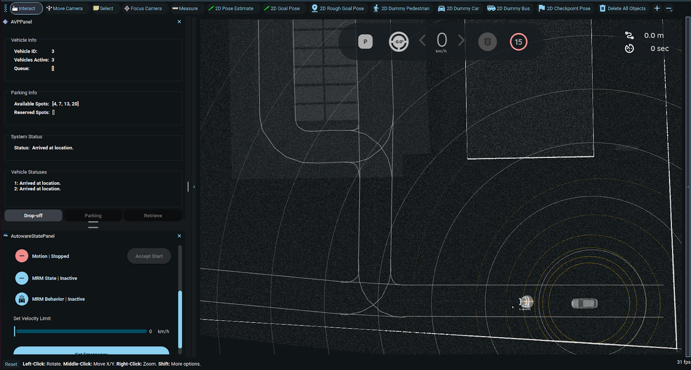

# Scaling to More Vehicles/Hosts

The framework can be extended beyond two vehicles by adding more hosts and namespaces. However, during testing with the available machines, certain issues were encountered that impacted performance.  

Despite these constraints, the framework remained fully operational. Instructions are given below, as well as an example using a third host.

## General Scaling Procedure

To extend the system, replicate the following for each additional vehicle/host:

1. Install **Autoware** and **Zenoh** on the new host.
2. Add a new ego vehicle in AWSIM Labs with a **unique namespace** (e.g., `/vehicle3`, `/vehicle4`, etc.).
3. Update Zenoh configuration to bridge the new namespace.
4. Connect the host to **Host 1** via Zenoh.

---

## Scalability Limitations

- Requires multiple physical machines (one Autoware instance per vehicle)
- Increasing the number of vehicles increases memory demands across the network and all machines.

---

## Third Host Example

To evaluate the scalability of the proposed architecture, a **third host (Victus Laptop)** was introduced alongside the existing **Nitro** and **ROG** hosts.

### Hardware Specification of Third Host

| **Host**   | **Model**                     | **CPU**              | **GPU**                 | **RAM** | **OS**        | **NVIDIA Driver** |
|------------|-------------------------------|----------------------|-------------------------|---------|---------------|-------------------|
| Victus Laptop   | HP Victus 15-fa1xxx            | Intel Core i5-12500H | GeForce RTX 4050        | 16 GB   | Ubuntu 22.04  | 575               |


A **third ego vehicle** was also added to the Unity simulation.

**Figure 1:** *Vehicle3 setup in Unity* (placeholder)

---

### Configuration Steps

1. Added a new ego vehicle GameObject in Unity, with all published topics namespaced under `/vehicle3`.

2. Created a dedicated clock publisher at `/vehicle3/clock` via the `Vehicle3_ClockPublisher` script.


      


3. Modified the UI camera bridge (`UICameraBridge` script) to adjust coordinate offsets for Vehicle 3 visualization.

      

---

### Results

After launching the simulation, all three vehicles were visible and initialized.

   


After the Zenoh connections, each vehicle localized successfully inside Autoware.

   **Vehicle 1 (Host 1)**

   

   **Vehicle 2 (Host 2)**

   

   **Vehicle 3 (Host 3)**

   


---


### DO A TEST

### Remaining Issue: Emergency State on Victus

- Host 3’s vehicle remained in an **emergency state** despite restored communications.
- Likely cause: **system memory constraints**.
- *Table 7.1* from the thesis showed that Victus (16 GB RAM) had far less free memory than Nitro/ROG (24 GB each), even with 32 GB swap configured.


This strongly suggests low available RAM on Victus caused the emergency-state failure.

| Setup       | Host        | Free Memory After Launch |
|-------------|-------------|--------------------------|
| Three-Host  | ROG Laptop  | 4.6 GiB                   |
|             | Nitro PC    | 721 MiB                   |
|             | Victus      | 209 MiB                   |
| Two-Host    | ROG Laptop  | 820 MiB                   |
|             | Nitro PC    | 2.0 GiB                   |

#### Victus Laptop

```bash
Zubair@AVLab:~$ free -h
               total        used        free      shared  buff/cache   available
Mem:            15Gi       9.4Gi       321Mi       795Mi       5.6Gi       5.0Gi
Swap:           31Gi       0.0Ki        31Gi
```

#### ROG Laptop

```bash
zubair@zubair-ROG-Zephyrus-G15:~$ free -h
               total        used        free      shared  buff/cache   available
Mem:            22Gi        13Gi       1.3Gi       263Mi       7.6Gi       9.1Gi
Swap:           31Gi          0B        31Gi
```

#### Nitro PC

```bash
ovin@ovin-Nitro-N50-640:~/multi-vehicle-avp/multi_vehicle_avp$ free -h
               total        used        free      shared  buff/cache   available
Mem:            23Gi        14Gi       903Mi       118Mi       8.0Gi       8.4Gi
Swap:           31Gi          0B        31Gi
```

---

## Communication Optimization

Before this test, all hosts ran Zenoh in **router mode**.  
- Occasionally, Host 2 would connect but fail to localize.  
- Adding a third host made this failure more frequent.

**Optimization:**  
- Keep **Host 1** in **router mode**.  
- Switch **Host 2** and **Host 3** to **client mode**.  

This change:
- Resolved the rare connection failures.
- Achieved **100% reliable message delivery** for all three vehicles.
- Was permanently adopted in the final AVP architecture.

---
