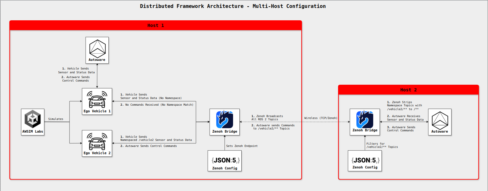
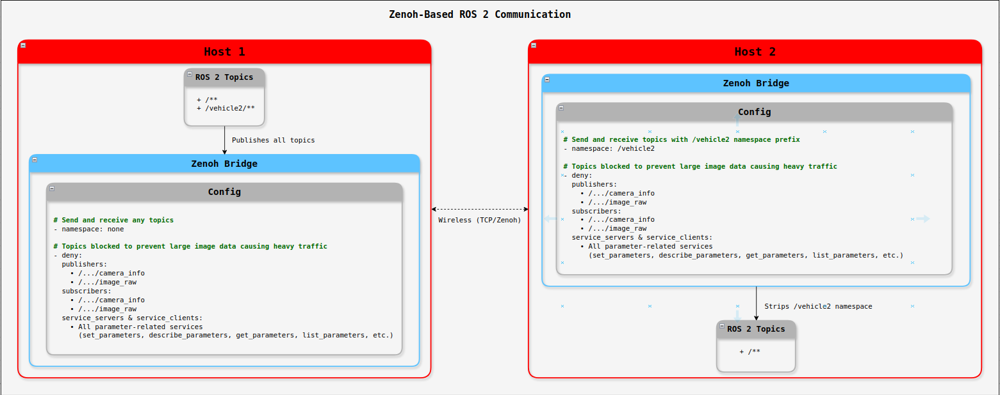

# System Architecture

This section outlines the software stack, hardware specifications, and machine roles. The architecture is built around a distributed, multi-host setup where each host handles specific tasks such as simulation, control, and coordination.

## Distributed Framework Architecture

See diagram in [full view](https://viewer.diagrams.net/?tags=%7B%7D&lightbox=1&highlight=0000ff&edit=_blank&layers=1&nav=1&title=Distributed%20Framework%20Architecture%20-%20Multi-Host%20Configuration&dark=auto#Uhttps%3A%2F%2Fdrive.google.com%2Fuc%3Fid%3D1QWieEbRPEVF_kHMBsqN-ph_WiZJWYDf-%26export%3Ddownload).

---

## Zenoh-Based ROS 2 Communication

See diagram in [full view](https://viewer.diagrams.net/?tags=%7B%7D&lightbox=1&highlight=0000ff&edit=_blank&layers=1&nav=1&title=Zenoh-Communication.drawio&dark=auto#Uhttps%3A%2F%2Fdrive.google.com%2Fuc%3Fid%3D1VGkrEYiPsvXtUnLiAkFGN7ufOgqsbEQV%26export%3Ddownload).

---

## Planning Your Deployment

Before diving into installation:  

1. **Check your hardware specs**. 
2. **Choose a deployment model**:  
    - **Single host** – simpler but more resource-intensive.  
    - **Multi-host** – distributed for better scalability.  

3. **Assign host roles** based on your hardware and number of simulated vehicles.

Continue reading this section for detailed specifications, role definitions, and scalability guidelines.

---

## Software Stack and Version Overview

| **Component**        | **Name**                  | **Version / Branch**                  |
|----------------------|---------------------------|---------------------------------------|
| Operating System     | Ubuntu                    | 22.04 LTS                             |
| ROS 2 Distribution   | ROS 2                     | Humble Hawksbill                      |
| Autonomy Stack       | Autoware Universe         | release/2024.11 (modified)            |
| Simulation Engine    | AWSIM Labs                | main (modified)                       |
| Middleware Bridge    | Zenoh Bridge for ROS 2    | `release/1.4.0`                       |

## Required Hardware Specifications

See [Required PC Specs](https://autowarefoundation.github.io/AWSIM-Labs/main/GettingStarted/QuickStartDemo/#pc-specs) for the minimal requirements to run AWSIM Labs.

## Hardware Specifications of Host Machines Used During Development

| **Host**   | **Model**                     | **CPU**              | **GPU**                 | **RAM** | **OS**        | **NVIDIA Driver** |
|------------|-------------------------------|----------------------|-------------------------|---------|---------------|-------------------|
| Nitro PC   | Acer Nitro N50-640            | Intel Core i7-12700F | GeForce RTX 3060        | 24 GB   | Ubuntu 22.04  | 575               |
| ROG Laptop | ASUS ROG Zephyrus G15 GA502IV | AMD Ryzen 7 4800HS   | GeForce RTX 2060 Max-Q  | 24 GB   | Ubuntu 22.04  | 575               |

## Host Roles

- **Host 1**: Runs AWSIM Labs, Autoware for `EgoVehicle_1` (no namespace), and Zenoh.  
- **Host 2**: Runs Autoware for `EgoVehicle_2` (namespaced as `/vehicle2`) and communicates with Host 1 via Zenoh.

---

## Design Considerations

If your machine meets or exceeds the Nitro PC specs, you may run AWSIM Labs and one Autoware instance on the same host. 

Otherwise, distribute components across machines to balance load. For example, AWSIM Labs and Zenoh on its own host, and Autoware and Zenoh on subsequent hosts.

---

## Scalability

The framework can be applied to use multiple hosts/vehicles.

See [Scaling for Multiple Vehicles](../../Scalability/ScalingToMoreVehicles/index.md).

---

**Next Steps:** Proceed to [Software Setup](../SoftwareSetup/index.md).
