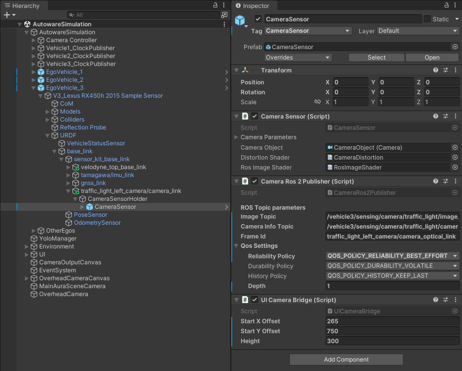

# Scaling to More Vehicles

The framework can be extended beyond two vehicles by adding more hosts and namespaces. However, during testing with the available machines, certain issues were encountered that impacted performance.  

Despite these constraints, the framework remained fully operational. Instructions are given below, as well as an example using a third host.

---

## Requirements

- Multiple physical machines (one Autoware instance per vehicle)

---

## Considerations

- Increasing the number of vehicles increases memory demands across the network and all machines.
- System performance may vary depending on host specifications and available resources.

---

## General Scaling Procedure

To extend the system, replicate the following for each additional vehicle/host:

1. Install **Autoware** and **Zenoh** on the new host.
2. Add a new ego vehicle in AWSIM Labs with a **unique namespace** (e.g., `/vehicle3`, `/vehicle4`, etc.).
3. Create and update Zenoh configuration to bridge the new namespace.
4. Connect the host to **Host 1** via Zenoh.

An example is shown below, where a third host is introduced.

---

## Third Host Example

To evaluate the scalability of the proposed architecture, a **third host (Victus Laptop)** was introduced alongside the existing **Nitro** and **ROG** hosts.

### Hardware Specification of Third Host

| **Host**   | **Model**                     | **CPU**              | **GPU**                 | **RAM** | **OS**        | **NVIDIA Driver** |
|------------|-------------------------------|----------------------|-------------------------|---------|---------------|-------------------|
| Victus Laptop   | HP Victus 15-fa1xxx            | Intel Core i5-12500H | GeForce RTX 4050        | 16 GB   | Ubuntu 22.04  | 575               |

---

### Configuration Steps

1. Add a new ego vehicle GameObject in Unity, with all published topics namespaced under `/vehicle3`.

2. Created a dedicated clock publisher at `/vehicle3/clock` via the `Vehicle3_ClockPublisher` script.

      

3. Modified the UI camera bridge (`UICameraBridge` script) to adjust coordinate offsets for Vehicle 3 visualization.

      

4. Create a Zenoh configuration file for Vehicle 3 (similar to Host 2). The file is already provided here: [zenoh-bridge-vehicle3.json5](https://github.com/zubxxr/multi-vehicle-framework/blob/main/zenoh_configs/zenoh-bridge-vehicle3.json5).

5. In each vehicle’s Zenoh configuration, explicitly deny the other vehicles’ topics to avoid cross-subscription.

      - For **Vehicle 3**, deny all topics under `/vehicle2/.*`.  
      - For **Vehicle 2**, deny all topics under `/vehicle3/.*`.  

---

### Multi-Vehicle Simulation (3 Hosts)

<iframe width="560" height="315" src="https://www.youtube.com/embed/5MeEh47mjOc?list=PL4MADLjXmDi1Q5XXCuFTEntWz1c_T50jd" title="YouTube video" frameborder="0" allowfullscreen></iframe>

---

## Discussion

During this three-host experiment, an issue was observed with the **Victus Laptop**. Unlike the other two vehicles, it did not begin moving immediately. At around **0:56 in the video**, when the first vehicle had already completed its route and the second was close to finishing, the third vehicle finally started driving.  

This delay could be attributed to several factors. For example, the **Victus host’s lower available memory**, potential **traffic overhead on the Zenoh bridge**, or even some **unresolved issue in the execution pipeline**. While the exact cause remains unclear, the resource constraints likely played a role in the delayed response.  

Further analysis of memory usage and host performance can be found in the [Benchmarks](../Benchmarks/index.md) section.

