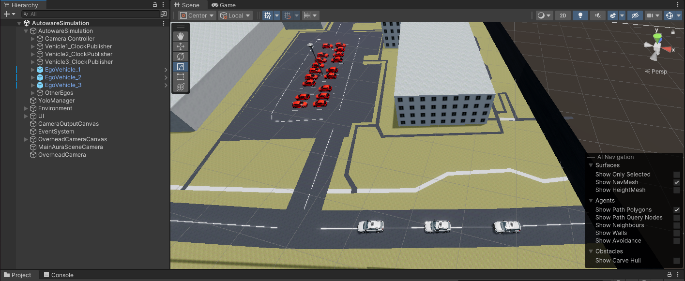
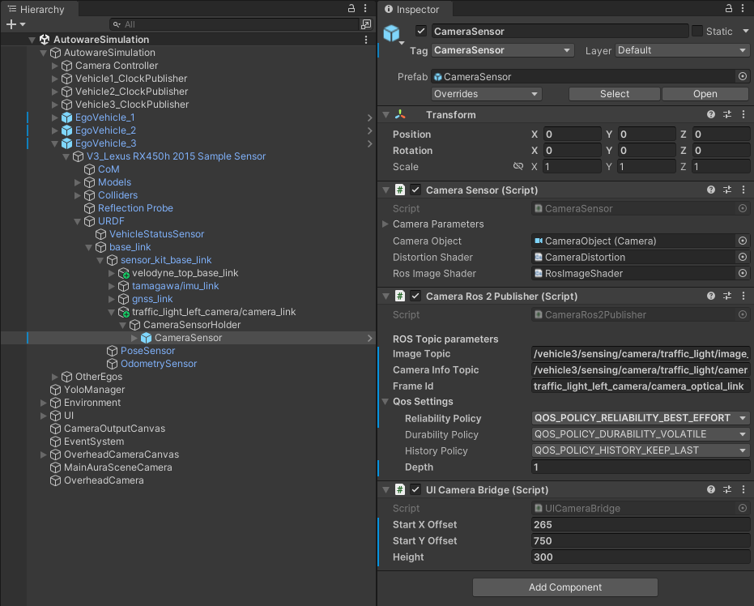

# Scaling to More Vehicles

DMAVA can be extended beyond two vehicles by adding more hosts and namespaces. However, during testing with the available machines, issues were encountered that impacted performance.  

Despite these constraints, DMAVA remained fully operational. Instructions are given below, as well as an example using a third host.

---

## Considerations

- Increasing the number of vehicles increases memory demands across the network and all machines.
- System performance may vary depending on host specifications and available resources.

---

## General Scaling Procedure

To extend the system, replicate the following for each additional vehicle/host:

1. Install **Autoware** and **Zenoh** on the new host.
2. Add a new ego vehicle in AWSIM Labs with a **unique namespace** (e.g., `/vehicle3`, `/vehicle4`, etc.).
3. Create and update Zenoh configuration to bridge the new namespace.
4. Connect the host to **Host 1** via Zenoh.

An example is shown below, where a third host is introduced.

---

## Third Host Example

To evaluate the scalability of the proposed architecture, a **third host (Victus Laptop)** was introduced alongside the existing **Nitro** and **ROG** hosts.

### Hardware Specification of Third Host

| **Host**   | **Model**                     | **CPU**              | **GPU**                 | **RAM** | **OS**        | **NVIDIA Driver** |
|------------|-------------------------------|----------------------|-------------------------|---------|---------------|-------------------|
| Victus Laptop   | HP Victus 15-fa1xxx            | Intel Core i5-12500H | GeForce RTX 4050        | 16 GB   | Ubuntu 22.04  | 575               |

---

### Configuration Steps

1. Add a new ego vehicle GameObject in Unity, with all published topics namespaced under `/vehicle3`.

2. Created a dedicated clock publisher at `/vehicle3/clock` via the `Vehicle3_ClockPublisher` script.

      

3. Modified the UI camera bridge (`UICameraBridge` script) to adjust coordinate offsets for Vehicle 3 visualization.

      

4. Create a Zenoh configuration file for Vehicle 3 (similar to Host 2). The file is already provided here: [zenoh-bridge-vehicle3.json5](https://github.com/zubxxr/multi-vehicle-architecture/blob/main/zenoh_configs/zenoh-bridge-vehicle3.json5).

5. In each vehicle’s Zenoh configuration, explicitly deny the other vehicles’ topics to avoid cross-subscription.

      - For **Vehicle 3**, deny all topics under `/vehicle2/.*`.  
      - For **Vehicle 2**, deny all topics under `/vehicle3/.*`.  

---

### Multi-Vehicle Simulation (3 Hosts)

<iframe width="560" height="315" src="https://www.youtube.com/embed/5MeEh47mjOc?list=PL4MADLjXmDi1Q5XXCuFTEntWz1c_T50jd" title="YouTube video" frameborder="0" allowfullscreen></iframe>

---

## Discussion

During the three-host experiment, a delayed start was observed for the vehicle running on the **Victus laptop**. Unlike the other two vehicles, this vehicle did not begin moving immediately. At approximately **0:56 in the video**, after the first vehicle had completed its route and the second was nearing completion, the third vehicle finally initiated motion.

This delay was caused by **network-related factors**, specifically increased communication latency and instability affecting inter-host message delivery over the Zenoh bridge during multi-host operation. The behavior was not attributable to CPU or memory limitations on the Victus host.

This observation highlights the sensitivity of distributed multi-vehicle execution to network conditions, even when computational resources are sufficient across all hosts.

Further discussion of host performance metrics and communication behavior is provided in the [System Performance & Network Characterization](../SystemPerformanceAndNetworkCharacterization/index.md) section.

