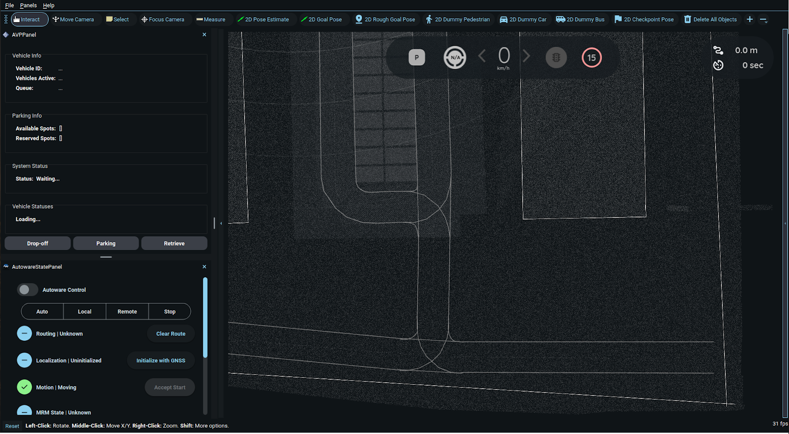

## 3. Multi-Vehicle Simulation

### 3.1 Prerequisites
Ensure the following components are set up on each host:

- **Host 1:** Runs AWSIM Labs, Autoware (for Vehicle 1), and Zenoh.  
- **Host 2:** Runs Autoware (for Vehicle 2) and Zenoh.

---

### 3.2 Launch Sequence
1. **Launch AWSIM Labs** (Host 1)
   
      See [Section 2.3.3 – Step 3](https://github.com/zubxxr/multi-vehicle-framework/tree/main?tab=readme-ov-file#234-awsim-labs-setup) for detailed instructions.

      


2. **Launch Autoware**

    **Host 1**
   
    Run the following command:
    ```bash
    source /opt/ros/humble/setup.bash
    source ~/autoware/install/setup.bash
    ros2 launch autoware_launch e2e_simulator.launch.xml vehicle_model:=awsim_labs_vehicle sensor_model:=awsim_labs_sensor_kit map_path:=$HOME/autoware_map/sirc/ launch_vehicle_interface:=true
    ```
    
    On Host 1, Autoware automatically connects to AWSIM Labs because both components are running on the same machine.
    
    


    **Host 2**
   
    Run the following command:
    ```bash
    source /opt/ros/humble/setup.bash
    source ~/autoware/install/setup.bash
    ros2 launch autoware_launch e2e_simulator.launch.xml vehicle_model:=awsim_labs_vehicle sensor_model:=awsim_labs_sensor_kit map_path:=$HOME/autoware_map/sirc/ launch_vehicle_interface:=true
    ```
    On Host 2, Autoware will remain in a waiting state until it receives an initial pose via Zenoh.

    


3. **Run the Zenoh Bridges**
   
      **Host 1**
      
      Run the following command:

      ```bash
      source ~/zenoh-plugin-ros2dds/install/setup.bash
      zenoh_bridge_ros2dds -c ~/multi-vehicle-avp/zenoh_configs/zenoh-bridge-awsim.json5
      ```
      
      **Host 2**
      
      Run the following command:
      ```bash
      source ~/zenoh-plugin-ros2dds/install/setup.bash
      zenoh_bridge_ros2dds -c ~/multi-vehicle-avp/zenoh_configs/zenoh-bridge-vehicle2.json5 -e tcp/<IP-address>:7447
      ```
      > Replace `<IP-address>` with the Host 1 IP address found in Step 3 of the [Zenoh Installation Steps](https://github.com/zubxxr/multi-vehicle-framework/blob/main/README_2.md#installation-steps-1).

      Once both Zenoh Bridges are connected, Autoware on Host 2 immediately receives the initial pose and localizes successfully.
      
      


### 3.3 Demonstration Scenarios: Goal Navigation & Parking

**Goal:** demonstrate two example scenarios—first, both vehicles navigating to distinct goal poses; second, both vehicles performing parking maneuvers.

1. **Set Distinct Goals**
   - **Vehicle 1:** use **Goal** tool and engage.
   - **Vehicle 2:** switch RViz to `/vehicle2` displays and use **Goal** tool again; then engage `/vehicle2`.